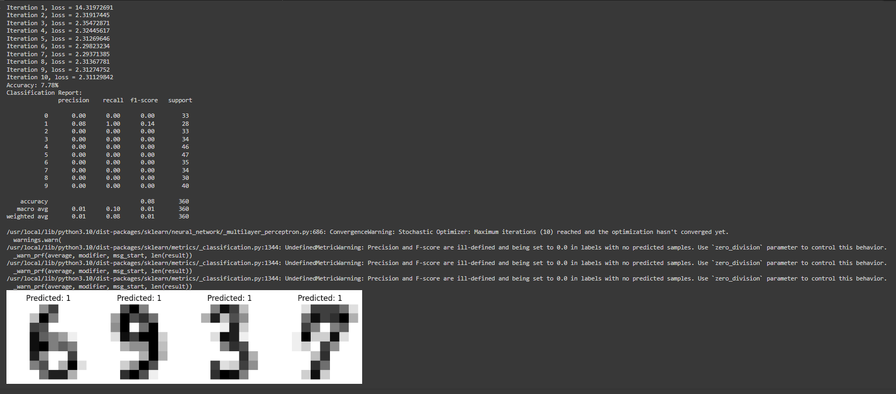

# Skill Assisessment-Handwritten Digit Recognition using MLP
## Aim:
To Recognize the Handwritten Digits using Multilayer perceptron.
##  EQUIPMENTS REQUIRED:
Hardware – PCs
Anaconda – Python 3.7 Installation / Google Colab /Jupiter Notebook
## Theory:

Handwritten digit recognition (HDR) is a classic task in the field of pattern recognition, and it has a wide range of applications, such as document processing, postal sorting, and optical character recognition (OCR). One of the most common approaches to HDR is to use Multi-Layer Perceptrons (MLPs). MLPs are a type of artificial neural network that is composed of multiple layers of interconnected neurons. Each neuron in an MLP takes as input a weighted sum of its inputs, and it outputs a value that is calculated using a nonlinear activation function. The weights of the connections between the neurons are learned during the training process.

The task of HDR can be formulated as a classification problem, where the goal is to classify each handwritten digit image into one of the ten possible classes (0 to 9).


## Algorithm :
Step 1: Import Libraries
Import the necessary libraries, such as NumPy for numerical operations, Matplotlib for visualization, and scikit-learn for machine learning functionalities.

Step 2: Load the Dataset
Load a handwritten digits dataset. A popular one is the digits dataset in scikit-learn, containing 8x8 pixel images of handwritten digits (0 through 9).

Step 3: Split the Dataset
Split the dataset into training and testing sets. This is crucial for assessing the model's performance on unseen data.

Step 4: Preprocess the Data
Flatten the images and preprocess the data if needed. Neural networks often benefit from having input data scaled or normalized.

Step 5: Create an MLP Model
Create an MLP (Multi-Layer Perceptron) model using a library like scikit-learn. Specify parameters such as the number of hidden layers, neurons in each layer, activation functions, and learning rate.

Step 6: Train the Model
Train the MLP model using the training dataset. During training, the model learns to map input features to the correct output labels.

Step 7: Make Predictions
Use the trained model to make predictions on the testing dataset. This step helps evaluate how well the model generalizes to new, unseen data.

Step 8: Evaluate the Model
Assess the model's performance using metrics like accuracy, precision, recall, and F1-score. These metrics provide insights into how well the model is performing on the task.

Step 9: Visualize Results (Optional)
Optionally, visualize some predictions to see how well the model is recognizing handwritten digits. Matplotlib is a handy tool for creating visualizations.

Step 10: Fine-Tune and Experiment
Experiment with different hyperparameters, architectures, and preprocessing techniques to improve the model's performance. Fine-tune until you achieve satisfactory result.


## Program:
```
DEVELOPED BY: BARATH S
REG NO: 212222230018
```
```python
import numpy as np
import matplotlib.pyplot as plt
from sklearn.neural_network import MLPClassifier
from sklearn.model_selection import train_test_split
from sklearn import datasets
from sklearn.metrics import accuracy_score, classification_report

# Load the digits dataset
digits = datasets.load_digits()

# Flatten the images and split the dataset into features (X) and labels (y)
n_samples = len(digits.images)
data = digits.images.reshape((n_samples, -1))
X = data
y = digits.target

# Split the dataset into training and testing sets
X_train, X_test, y_train, y_test = train_test_split(X, y, test_size=0.2, random_state=42)

# Create and train the MLP model
mlp = MLPClassifier(hidden_layer_sizes=(50,), max_iter=10, alpha=1e-4,
                    solver='sgd', verbose=10, tol=1e-4, random_state=42,
                    learning_rate_init=0.1)

mlp.fit(X_train, y_train)

# Make predictions on the test set
y_pred = mlp.predict(X_test)

# Evaluate the model's performance
accuracy = accuracy_score(y_test, y_pred)
classification_rep = classification_report(y_test, y_pred)

print("Accuracy: {:.2f}%".format(accuracy * 100))
print("Classification Report:\n", classification_rep)

# Visualize a few predicted digits
fig, axes = plt.subplots(1, 4, figsize=(10, 4))
for i, ax in enumerate(axes):
    ax.imshow(X_test[i].reshape(8, 8), cmap=plt.cm.gray_r, interpolation='nearest')
    ax.set_title(f"Predicted: {y_pred[i]}")
    ax.axis('off')

plt.show()
```


## Output :



## Result:
THus a program To Recognize the Handwritten Digits using Multilayer perceptron has been executed successfully.
